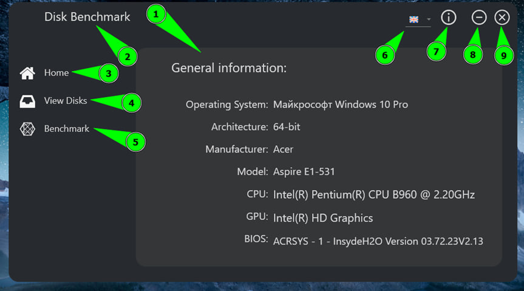
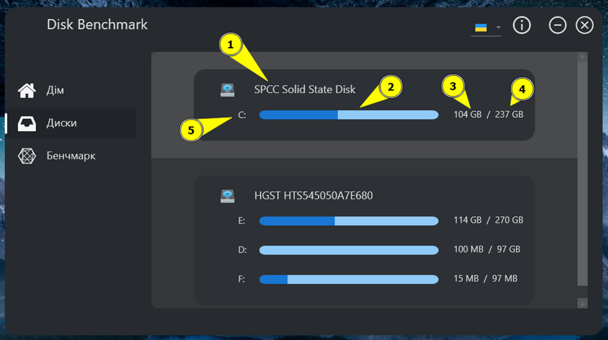
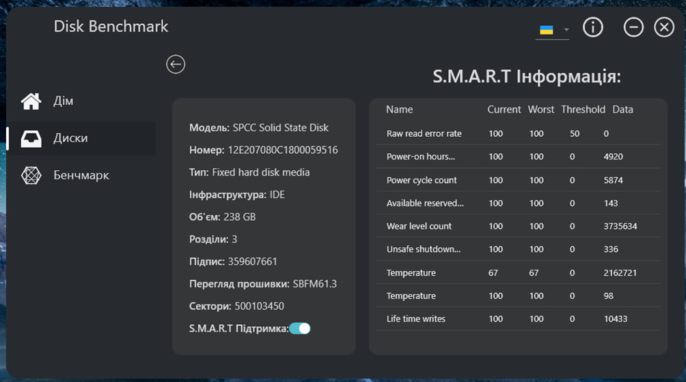
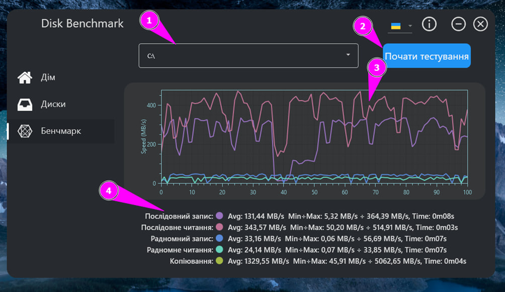
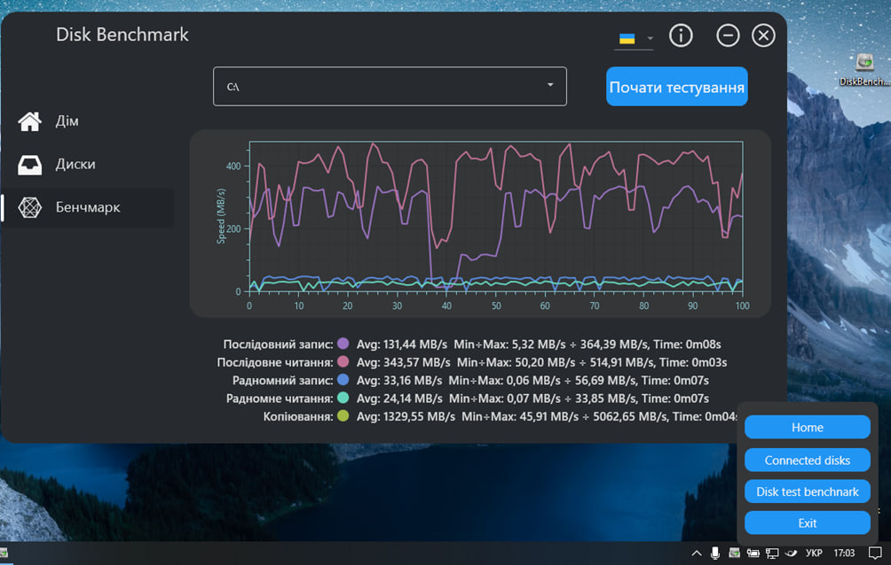

# Description
A utility for displaying the status of a storage medium, as well as for testing the read/write and copy speeds. 
# How to use?
First of all, you need to download .exe file from Releases secrtion and start one.
# Program View
The software solution looks like this:
## Home page

1.	The application context that displays the pages.
2.	The title of the application.
3.	A button to open the home page.
4.	Button to open the disc browse page.
5.	Button to open the disc test page.
6.	List of localisations.
7.	Button to get information about the programme.
8.	Button to reduce the window.
9.	Button to close the application.

## Disks list page

The list displays the following information:
1.	Media name;
2.	Graphical representation of the used volume;
3.	Numerical representation of the volume used;
4.	Total volume;
5.	Logical disc names;

When you click on one of the connected media, the user is taken to the next page - the page for viewing detailed information about the disk.

## Disk details
On this page, the user receives detailed information about the storage medium, such as model, serial number, number of partitions, number of sectors, and whether smart attributes are supported.

## Memory media performance testing page

This page is intended for testing drives connected to the device

This page contains the following elements:
1.	List of active drives. If a disk is not active or its total capacity is less than 1 GB, it will not be displayed in the list.
2.	Button to start the test. This button becomes active only when the user has already selected a disc for testing, otherwise the user will not be able to start testing.
3.	Graph to display the test results.
4.	A list of the types of testing that will be performed. For the convenience of displaying and understanding the results, unique labels have been added for each test to identify them on the graph.

### This utility also has the ability to be attached to the system tray

A single click opens the system tray menu of the utility, which can also switch between pages and close the utility itself. Double-clicking on the utility icon opens the window if it was previously hidden.
